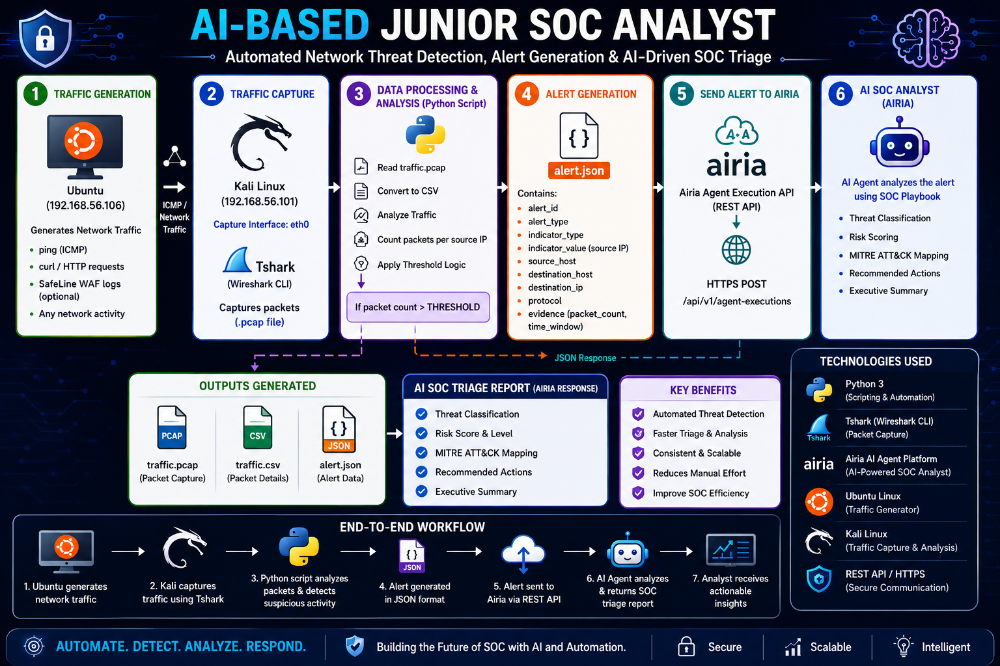

# 🛡️ AI-Based Junior SOC Analyst

> **Automated Network Threat Detection & AI-Driven SOC Triage using Python, TShark, and Airia AI**

---

# 📖 Project Overview

Modern Security Operations Centers (SOCs) process thousands of security alerts every day, making rapid and accurate triage essential. This project demonstrates how Artificial Intelligence can automate the initial investigation of network security events, helping analysts prioritize alerts and reduce manual effort.

**AI-Based Junior SOC Analyst** is an end-to-end cybersecurity automation project that simulates the workflow of a Tier-1 SOC analyst. The solution captures live network traffic using **TShark**, analyzes packet activity with a custom **Python** automation script, detects suspicious network behavior based on configurable thresholds, generates structured **JSON** alerts, and submits them to an **AI-powered SOC Analyst** built on **Airia AI**.

The AI agent follows a custom SOC playbook to automatically analyze the alert, classify the threat, calculate a risk score, map the activity to the **MITRE ATT&CK Framework**, recommend appropriate analyst actions, and generate an executive summary.

This project demonstrates the integration of **Network Security**, **Python Automation**, **Packet Analysis**, **REST APIs**, and **Artificial Intelligence** to build an intelligent SOC workflow that reduces manual analysis while improving the speed and consistency of security investigations.

---

## 🎯 Project Objectives

- Capture live network traffic using TShark.
- Analyze packet activity using Python automation.
- Detect suspicious network behavior based on configurable thresholds.
- Generate structured JSON security alerts automatically.
- Integrate with Airia AI through its REST API.
- Automate SOC alert triage using a custom SOC playbook.
- Provide risk scoring, MITRE ATT&CK mapping, and recommended analyst actions.
- Demonstrate how AI can support Tier-1 SOC analysts during incident triage.

---

# ✨ Key Features

- 📡 **Live Network Traffic Capture** using TShark for real-time packet collection.
- 🐍 **Python-Based Automation** to analyze captured traffic and identify suspicious network activity.
- 📊 **Threshold-Based Detection Logic** to detect abnormal packet volume from source IP addresses.
- 📄 **Automatic JSON Alert Generation** containing structured security event information.
- 🤖 **AI-Powered SOC Triage** using Airia AI and a custom SOC playbook.
- 🎯 **Threat Classification** based on structured alert data.
- 📈 **Risk Scoring & Confidence Assessment** for prioritizing security incidents.
- 🛡️ **MITRE ATT&CK Mapping** to align detected activity with industry-standard attack techniques.
- 📋 **Automated Analyst Recommendations** to assist Tier-1 SOC analysts during investigations.
- 🔗 **REST API Integration** for seamless communication between Python automation and Airia AI.
- 💻 **Virtual Lab Environment** built using Ubuntu and Kali Linux.
- 📦 **Modular Design** allowing the detection logic and AI playbook to be easily extended.

---

---

# 🛠️ Technology Stack

| Category | Technology |
|----------|------------|
| Programming Language | Python 3 |
| Operating Systems | Ubuntu Linux, Kali Linux |
| Network Analysis | TShark, Wireshark |
| Virtualization | Oracle VirtualBox |
| Network Protocol | ICMP |
| Data Format | JSON, CSV, PCAP |
| AI Platform | Airia AI |
| API Communication | REST API |
| Security Framework | MITRE ATT&CK Framework |
| Detection Method | Threshold-Based Packet Analysis |
| Version Control | Git & GitHub |

This project combines traditional network traffic analysis with AI-powered security automation to simulate the workflow of a modern Tier-1 Security Operations Center (SOC) analyst.
---
