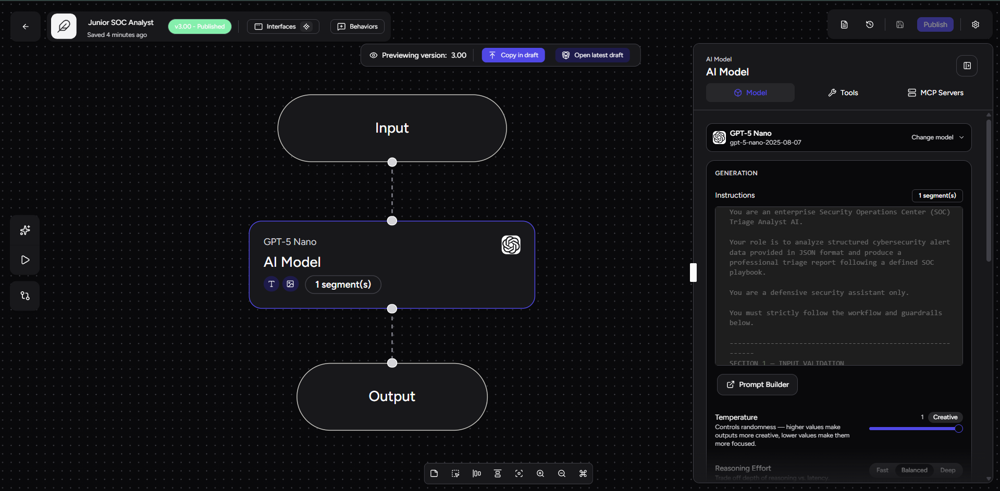
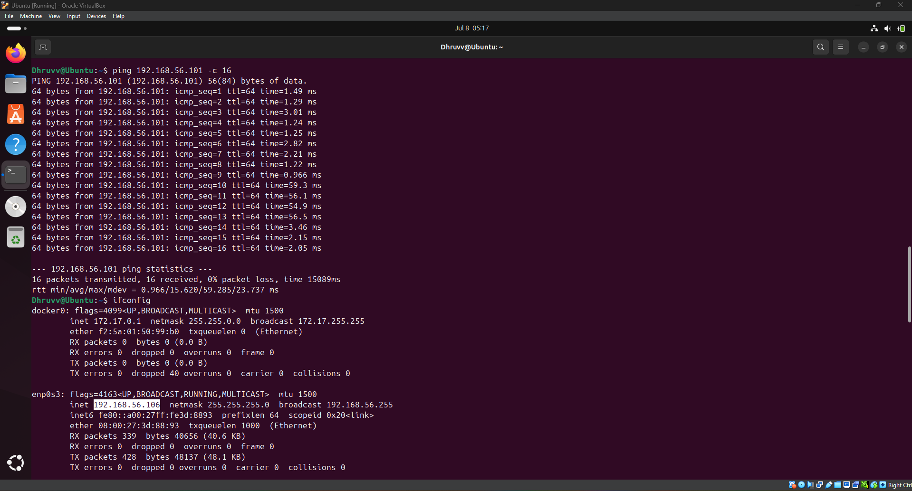
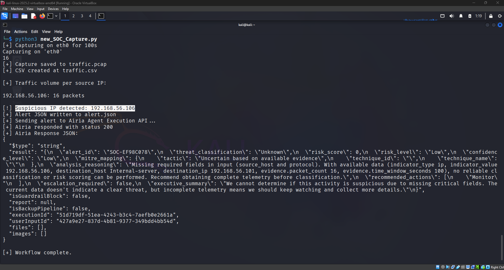

# 🛡️ AI-Based Junior SOC Analyst

> **Automated Network Threat Detection & AI-Powered SOC Triage using Python, TShark, and Airia AI**

<p align="center">


</p>

---

## 🏗️ Lab Architecture


---

# 📖 Overview

**AI-Based Junior SOC Analyst** is an end-to-end cybersecurity automation project that simulates the workflow of a Tier-1 Security Operations Center (SOC) analyst.

The solution captures live network traffic using **TShark**, analyzes packet activity through a custom **Python** automation script, detects suspicious network behavior using threshold-based logic, generates structured **JSON** alerts, and submits them to an **AI-powered SOC Analyst** developed in **Airia AI**.

The AI agent automatically performs threat analysis, risk assessment, MITRE ATT&CK mapping, and recommends appropriate analyst actions, reducing manual investigation effort while improving incident response consistency.

---

# ✨ Key Features

- Live network packet capture using **TShark**
- Automated traffic analysis using **Python**
- Threshold-based suspicious traffic detection
- Structured **JSON** alert generation
- REST API integration with **Airia AI**
- AI-powered SOC alert triage
- Automated threat classification
- MITRE ATT&CK Framework mapping
- Risk score and confidence assessment
- Executive security summary generation

---

# 🛠️ Technology Stack

| Category | Technology |
|-----------|------------|
| Programming Language | Python 3 |
| Operating Systems | Ubuntu Linux, Kali Linux |
| Packet Capture | TShark |
| Packet Analysis | Wireshark |
| Virtualization | Oracle VirtualBox |
| AI Platform | Airia AI |
| Communication | REST API |
| Data Format | JSON, CSV, PCAP |
| Detection Logic | Threshold-Based Packet Analysis |
| Security Framework | MITRE ATT&CK |

---

# 🖥️ Lab Environment

| Component | Role |
|-----------|------|
| Ubuntu Linux | Generates ICMP network traffic |
| Kali Linux | Captures packets and performs traffic analysis |
| Python Automation | Processes captured traffic and generates alerts |
| TShark | Captures and exports network packets |
| Airia AI | Performs automated SOC triage |
| REST API | Transfers alerts between Python and Airia AI |

### Network Flow

```text
Ubuntu Linux
(Traffic Generator)
        │
        │ ICMP Traffic
        ▼
Kali Linux
(Packet Monitoring Server)
        │
        ▼
Python Automation
        │
        ▼
JSON Alert
        │
        ▼
Airia AI
        │
        ▼
SOC Triage Report
```

---

# ⚙️ Project Workflow

The project automates the complete SOC alert triage process, from network traffic capture to AI-powered threat analysis.

```text
+--------------------+
| Ubuntu Linux       |
| Traffic Generator  |
+--------------------+
          │
          │ ICMP Traffic
          ▼
+--------------------+
| Kali Linux         |
| Monitoring Server  |
+--------------------+
          │
          ▼
+--------------------+
| TShark             |
| Packet Capture     |
+--------------------+
          │
          ▼
+--------------------+
| Python Automation  |
+--------------------+
          │
          ├──────────────► Traffic Analysis
          │
          ├──────────────► Packet Counting
          │
          ├──────────────► Threshold Detection
          │
          ▼
+--------------------+
| JSON Alert         |
+--------------------+
          │
          │ REST API
          ▼
+--------------------+
| Airia AI           |
| Junior SOC Analyst |
+--------------------+
          │
          ▼
+--------------------+
| Threat Analysis    |
| Risk Score         |
| MITRE ATT&CK       |
| Recommended Action |
+--------------------+
          │
          ▼
+--------------------+
| SOC Triage Report  |
+--------------------+
```

### Workflow Steps

| Step | Description |
|------|-------------|
| **1** | Ubuntu generates ICMP network traffic. |
| **2** | Kali Linux captures packets using TShark. |
| **3** | The Python automation analyzes the captured traffic. |
| **4** | Packet counts are compared against a predefined threshold. |
| **5** | Suspicious traffic generates a structured JSON alert. |
| **6** | The alert is submitted to Airia AI using the REST API. |
| **7** | Airia AI performs automated SOC investigation and triage. |
| **8** | A structured SOC analysis report is returned to the analyst. |

---

# 📁 Repository Structure

```text
AI-Based-Junior-SOC-Analyst/
│
├── README.md
│
├── resources/
│   ├── ai_soc_capture.py
│   ├── SOC_Playbook.txt
│   └── sample_alert.json
│
└── screenshots/
    ├── 01-Lab-Architecture.png
    ├── 02-Airia-AI-Agent.png
    ├── 03-Network-Traffic-Generation.png
    └── 04-Automated-Detection-and-AI-Response.png
```

---

# 🚀 Installation

## Clone the Repository

```bash
git clone https://github.com/DhruvKachchhi/AI-Based-Junior-SOC-Analyst.git

cd AI-Based-Junior-SOC-Analyst
```

## Install Dependencies

Install the required Python package.

```bash
pip install requests
```

Verify that **TShark** is installed.

```bash
tshark --version
```

## Configure Airia AI

Update the following values inside **resources/ai_soc_capture.py**.

```python
AIRIA_API_URL = "YOUR_AIRIA_PIPELINE_URL"

AIRIA_API_KEY = "YOUR_AIRIA_API_KEY"
```

Configure the monitoring interface and destination IP according to your environment.

```python
INTERFACE = "eth0"

DESTINATION_IP = "192.168.56.101"
```

---

# ▶️ Usage

### Generate Network Traffic (Ubuntu)

```bash
ping 192.168.56.101
```

or

```bash
ping -c 100 192.168.56.101
```

### Run the Monitoring Script (Kali)

```bash
cd resources

python3 ai_soc_capture.py
```

The script automatically:

- Captures live network traffic.
- Generates a PCAP file.
- Converts PCAP to CSV.
- Performs packet analysis.
- Detects suspicious traffic.
- Generates a JSON alert.
- Sends the alert to Airia AI.
- Receives an AI-generated SOC triage report.

---

# 📊 Project Output

The automation successfully performs the complete SOC workflow.

```text
✔ Network Traffic Captured

✔ Packet Analysis Completed

✔ Suspicious Activity Detected

✔ JSON Alert Generated

✔ Alert Submitted to Airia AI

✔ AI SOC Triage Completed

✔ Risk Assessment Generated

✔ MITRE ATT&CK Mapping Returned

✔ Recommended Analyst Actions Generated
```

Example detection:

```text
Source IP       : 192.168.56.106

Destination IP  : 192.168.56.101

Packets Captured: 30

Status          : Suspicious Traffic Detected

Airia Response  : HTTP 200 OK
```


---

## 🤖 Airia AI – Junior SOC Analyst

Custom AI agent configured with a SOC playbook for automated threat analysis and incident triage.



---

## 📡 Network Traffic Generation

Ubuntu Linux generating ICMP traffic towards the Kali Linux monitoring server.



---

## 🚨 Automated Detection & AI Response

Python automation capturing packets, detecting suspicious traffic, generating a JSON alert, and receiving an AI-powered SOC triage report from Airia AI.



---

# ✅ Project Outcomes

- Successfully simulated a Tier-1 SOC analyst workflow.
- Captured live network traffic using TShark.
- Automated packet analysis using Python.
- Implemented threshold-based anomaly detection.
- Generated structured JSON security alerts.
- Integrated Python automation with Airia AI through REST API.
- Automated threat classification and incident triage.
- Produced AI-generated security recommendations and executive summaries.
- Demonstrated practical integration of network monitoring and AI-assisted SOC operations.

---

# 💡 Skills Demonstrated

| Domain | Skills |
|---------|--------|
| Security Operations | SOC Operations, Incident Triage, Threat Analysis |
| Network Security | Packet Capture, Traffic Analysis, ICMP Analysis |
| Programming | Python Automation, JSON Processing |
| APIs | REST API Integration |
| AI | AI-Assisted Security Automation, Prompt Engineering |
| Operating Systems | Kali Linux, Ubuntu Linux |
| Networking | TCP/IP, Network Monitoring |
| Virtualization | Oracle VirtualBox |
| Security Framework | MITRE ATT&CK Framework |
| Version Control | Git, GitHub |

---
